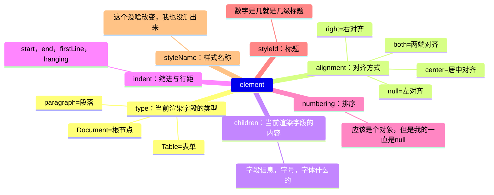

# 文档预览服务

**支持格式** doc、docx、xls、xlsx、ppt、pptx、pdf、ofd、zip、rar、txt、rtf、jpg、tiff、mp4、mp3

github地址:嗯....抱歉，这是一个网页

[XDOC文档预览服务官网](https://view.xdocin.com/)

[永中云转换官网](https://api.yozocloud.cn/index.html)

**异同点**两者都是拼接链接预览的模式，两个我都用了，不是拉这个踩那个啊，有一点区别是XDOC文档预览服务我直接就打开了，而且还贴心的给了个目录功能，而永中云转换这个捏，我打开之后，嘎，先来10s广告，我麻了呀，这咋还能有广告呢，去掉广告需要收费，体验十分的差，所以我下面就说一下XDOC文档预览怎么用，反正都一样的用法


**简介过程**打开官网，中文的还是，很人性化，都不用我翻译文档都看的懂，很简洁，还有QQ群咨询，不过这都不重要，往下划拉划拉，咱进入正题

- 准备：在Dom结构中创建一个iframe标签，因为它最后返回的也是一个htm后缀的链接

- 第一步：复制服务端链接 `https://view.xdocin.com/view?src=`；

- 第二步：这里注意啊，这种方式只能是url形式的，也就是你的文档必须是链接，把你的链接进行统一编码 `encodeURIComponent(url)`；

- 第三步：这里可以直接把第一步第二步链接合并直接指定 `iframe.value.src = https://view.xdocin.com/view?src=encodeURIComponent(url)`
或者按照文档Api来
```
axios({
	url: `https://view.xdocin.com/view?`,
	params: {
		func: 'url',
		format: 'json',
		src: `${url}`,
	},
}).then((val) => {
	iframe.value.src = `${val.data.result}`;
});
```

**总结**那个有广告的我就不说了，因为没付费我体验不到后续的服务，XDOC文档预览这个呢，它有缓存，也就是同一个文档链接，你只是修改了文档内容的话，界面这边是刷新不了的，需要在每次请求前加入它专门的刷新Api `axios.get(”https://view.xdocin.com/view?func=refresh&src=拼接文档url“)`
> 其他都还好，支持预览的格式也不少，还可以加水印，免费嘛，这玩意我就能体验到这些，剩下的比如私人部署啊，收费服务啊，都有，安不安全，只要钱到位，应该都安全

---
# mammoth.js

**支持格式** docx

github地址：https://github.com/mwilliamson/mammoth.js

**参考文献**https://juejin.cn/post/7194716040985575461?searchId=20230905113459CEAC35BFA36208B29D75#heading-2

**简介过程**我先搜索的mammoth，它排第一，有4.2K的星星，直觉告诉我，就是它，满怀期待点进去后，第一步先翻译一下中文，嗯....介绍的很符合我的需求，再一看使用过程，so easy。


第一步：引入，怎么写就省略了，我也不会。

第二步：按照文档`mammoth.convertToHtml({ path:'/src/assets/测试文件.docx' })`
path替换文档路径，出乎意料，控制台给了我一个黄牌：`Unhandled rejection Error: Could not find file in options`，虽然在意料之外，但是我觉得也是情理之中，毕竟第一次，`mammoth.convertToHtml({ path:'@/assets/测试文件.docx' })`，黄牌！ `mammoth.convertToHtml({ path:'../../assets/测试文件.docx' })`，黄牌！事不过三，再研究研究，官网划拉到一半我发现了这个方法的Api，擦，path的写法是node.js的，浏览器的写法要arrayBuffer的，我套你个猴子

第二步（新）：
>  `<input type="file">`上传一个文件 ，通过FileReader专门处理文件的Api获取arrayBuffer
```
file就是上传的文件，大概方法就是写一个input上传文件，再写一个按钮，
先上传文件，在按钮点击事件的回调里面去获取这个input， document.getElementById("wordFileInput").files[0]这个就是file了

const reader = new FileReader();
reader.onload = function(loadEvent: Event) {
  const arrayBuffer = loadEvent.target["result"];
};
reader.readAsArrayBuffer(file);
```
> 生成一个文档的链接，请求过来也是可以的

```
axios({
	url,
	responseType: 'arraybuffer',
}).then((val) => {
	mammoth.convertToHtml({ arrayBuffer: val.data }).then((res) => {
		在这个里面res的value就是生成的标签了，是一个字符串DOM结构，
		所以想展示到页面上，你就整一个Div指定一下innerHTML
		Div.innerHTML = res.value;
	});
});
```
很棒，这时候页面上就会展示出来你的文档，但是很遗憾，没啥用，就是纯文本，没有你在word中设置的样式，比如居中啊，缩进啊，字号啊，字体啊等等都没有，不过人家也没啥错，你就说预览没预览吧，最后，我又扒拉扒拉文档，在掘金上找找大佬的文章，没错，我又找到了
> convertToHtml这个方法有第二个参数，是个对象，其他的重要，有个key很重要，
就是transformDocument，它是可以自定义进行文档转换的

```
function transformParagraph(element) {
   这里这个element就是你文档经过一系列我也不懂的流程，最后生成的包含文档内容的字段信息，
具体的往下划拉划拉，我写下面了
	return element;
}
var options = {
	transformDocument: mammoth.transforms.paragraph(transformParagraph),
};
mammoth.convertToHtml({ arrayBuffer: val.data }, options)
```



注！！！
- type对应的值我的只会有paragraph，剩下两个type值是掘金大佬的有，我也不知道是不是我用错了方式；
- numbering我的也一直都是null，大佬的是一个对象，里面有字段代表是否有序排列；
- styleName是可以修改的，好像是自定义的一个映射表

总结：其实这个的可玩性还是很高的，可以自己定义，如果有时间有空，真的可以把所有的都按照自己的设计主题输出出来，但是我太菜了，没整好

---
# vue-office

github地址：https://github.com/501351981/vue-office

**支持格式** docx、pdf、xlsx

**简介过程** 在寻找预览的掘金文章中，我还发现了一个出现次数比较多的方式 `docx-preview` 我去github上搜索了一下，结果，没搜到，是的，你没看错，这个同名的开源库我没在github上找到，所以就一直没用，没体验过，但是，我搜索这个的时候，排名第一，有1.5K星的是一个叫 `vue-office`体验了一下，总体来说还可以，基本功能预览都是符合在word中配置的好的，但是有的功能是不显示的，例如高亮块，分割线

**步骤** 中文文档我就不写步骤了，灰常简单，下载依赖，引入，vue框架的直接组件显示就行，不是框架的人家文档里也写了，多下载个插件阔以


**总结** `vue-office` 比 `mammoth` 好的一点就是基本样式不用整，缩进，对齐方式什么的默认都正好了，而且还兼容vue框架，上面拼链接的形式生成前都会有一个去不掉的loading，这个`vue-office`就可以自定义，然后在渲染完成的回调里自己按需求操作，非常的人性化

# docxjs

github地址：https://github.com/VolodymyrBaydalka/docxjs

**简介过程** 到上边的 `vue-office`我其实已经准备收手了，但是好奇心驱使我想要对 `docx-preview` 一探究竟，所以，打开我心爱的小掘金，它永远不会失望，因为上边在github搜索同名没搜索到，但是有大佬文章里面又直接下载依赖的，我就通过npm查找到了这个第三方库，它里面介绍的github地址，点过去之后才发现，名字叫docxjs，星星有656颗，还阔以

**第一步** 打开github的文档后，咱们第一步永远是翻译中文啊，谷歌也是非常的人性化，这个库的描述也非常简单，在最后说了这个库不稳定，会打乱界面，所以只有一个稳定并且之后不会更改定义，但是会可能优化解析和渲染的API就是 `renderAsync`

**第二步** 下载依赖并引入 `npm install docx-preview`

**第三步** 请求文档地址，第一个参数就是文档信息流，类型可以使Blob、ArrayBuffer、Uint8Array都可以，第二个参数就是你想在哪个容器里去渲染
```
axios({
	url,
	responseType: 'arraybuffer',
}).then((val) => {
	renderAsync(val.data,htmlViewRef.value);
});
```
**总结** 最后渲染的结果出乎意料，跟 `vue-office` 一模一样，连Dom结构和命名都是一字不差，所以体验感跟`vue-office`一样的


# 体验总结
首先这些方法都是免费的，其次是这些方法也都是纯前端就可以用的，最简单的调用方式，如果真的有需求要用到的话，可以用三个第三方库的，自己调整样式结构，如果有钱的话可以试试拼链接的形式，可以联系人家，部署自己的样式，追求安全的话，可以使用阿里云的，腾讯云的，这两个巨佬也是有的，给你十分的安全感

